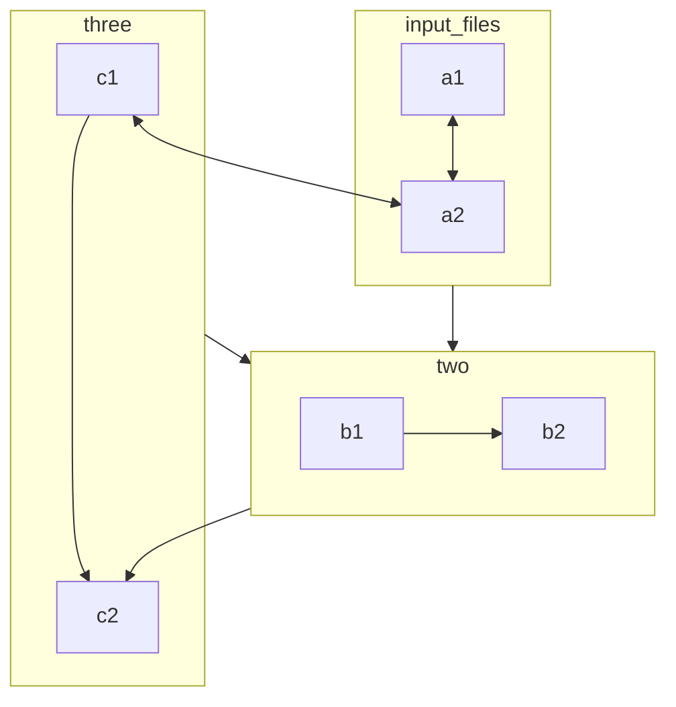
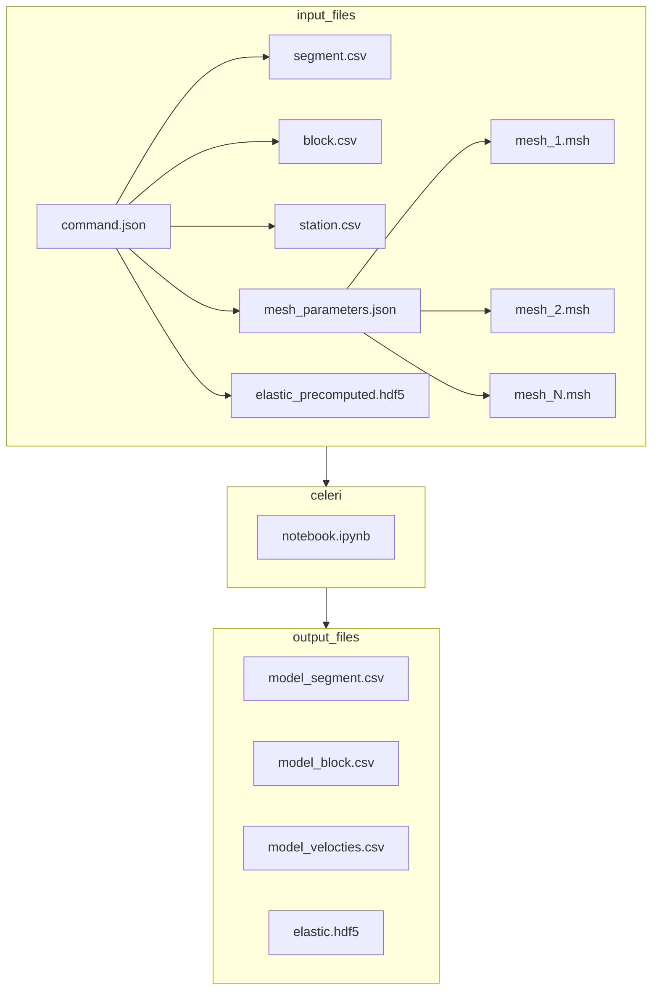

<p align="center">
  
</p>

## celeri - Next generation earthquake cycle and surface deformation modeling
A python port, reworking, and extension of the Matlab-based [blocks](https://github.com/jploveless/Blocks) featuring:
- Much smaller memory footprint
- Much faster elastic calculations
- Much faster block closure
- Eigenfunction expansion for partial coupling

To set up a development conda environment, run the following commands in the `celeri` folder.
```
conda config --prepend channels conda-forge
conda env create
conda activate celeri
pip install --no-use-pep517 -e .
```

Then start your favorite notebook viewer (`jupyter lab` or `vscode`) and open and run `celeri.ipynb`.

### Relationships of input files



