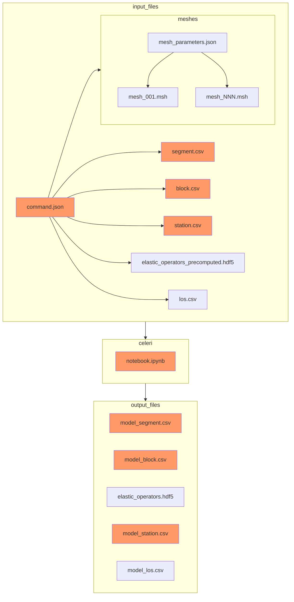

# Quasi-static imaging of earthquake cycle kinematics
`celeri` is a python-based package designed to image earthquake cycle activity including the spatial and time varying fault coupling across geometrically complex fault systems at large scales. It features:

- Friendly [Jupyter notebook examples](https://github.com/brendanjmeade/celeri/blob/main/notebooks/celeri_dense.ipynb)
- Web-based model building with [`celeri_ui`](https://brendanjmeade.github.io/celeri_ui/)
- Graphical comparisions of model results with [`result_manager`](https://github.com/brendanjmeade/result_manager)
- 3D visualzation of model geometry and results with [`parsli`](https://github.com/brendanjmeade/parsli)
- Fast and automated block closure on the sphere
- Small memory footprint (via distance weighted eigenmodes)
- Blazingly fast elastic calculations (via [Ben Thompson's](https://github.com/tbenthompson) [C-based triangular dislocation calculations](https://github.com/tbenthompson/cutde))
- Easy IO with standard file types (.csv, .json, .hdf5)
- Rapid model diffs with [`celeri_report.py`](https://github.com/brendanjmeade/celeri/blob/main/notebooks/celeri_report.py)

---
# Getting started
To set up a development conda environment, install [pixi](https://pixi.sh/) and run the following command in the `celeri` folder.
```bash
pixi shell
```

Alternatively, run the following commands in the `celeri` folder.
```
conda config --prepend channels conda-forge
conda env create
conda activate celeri
pip install --no-use-pep517 -e .
```

From here you can launch model runs with `celeri_solve`.

To run notebooks from VSCode:
1. cd to the `celeri` folder.
2. Use  `code .` to start VSCode form the command line.
3. Navigate to the notebook you'd like to run.
4. Click on the python environment selector near the upper right hand corner of the VSCode window.
5. Select the "default" shell.
6. Run notebook.


---

If you wish to submit a PR then please run `pre-commit install` to install the [pre-commit](https://pre-commit.com/) hooks.

---
### Folder structure and file locations for applications
A large number of input files can be involved in a model run.  We assume that a project is arranged using the following folder structure:
```
project_name/
├── README.md
├── notebooks/
│   ├── block_model.ipynb
│   ├── visualize_results.ipynb
│   └── resolution_tests.ipynb
├── data/
|   ├── command/
│   |   ├── command_001.json
│   |   └── command_NNN.json
│   ├── segment/
│   │   ├── segment_001.csv
│   │   └── segment_NNN.csv
│   ├── block/
│   │   ├── block_001.csv
│   │   └── block_NNN.csv
│   ├── station/
│   │   ├── station_001.csv
│   │   └── station_NNN.csv
│   ├── mesh/
│   |   ├── mesh_params_001.json
│   |   ├── mesh_params_NNN.json
│   |   ├── mesh_001.msh
│   |   └── mesh_NNN.msh
|   └── operators/
│       ├── elastic_001.hdf5
│       └── elastic_NNN.hdf5
└── runs/
    ├── 2022-02-20-17-01-39/
    │  ├── 2022-02-20-17-01-39.log
    │  ├── elastic_operators.hdf5
    │  ├── model_segment.csv
    │  ├── model_block.csv
    │  └── model_station.csv
    └── NNNN-NN-NN-NN-NN-NN/
       ├── NNNN-NN-NN-NN-NN-NN.log
       ├── elastic_operators.hdf5
       ├── model_segment.csv
       ├── model_block.csv
       └── model_station.csv
```

### The flow of files in and out of celeri
The files listed above flow into celeri through `command.json` file. Files with dark orange background shading are required (automatically generated) and those with light blue background shading are optional (not automatically generated)


# Other earthquake cycle kinematics software
We think celeri is pretty great but there are other alternatives worth considering:
- Jack Loveless' and Brendan Meade's Matlab-based [Blocks](https://github.com/jploveless/Blocks)
- Rob McCaffrey's Fortran-based [TDEFNODE](https://robmccaffrey.github.io/TDEFNODE/TDEFNODE.html)
- Richard Styron's Julia-based (and cleverly named!) [Oiler](https://github.com/cossatot/Oiler)
