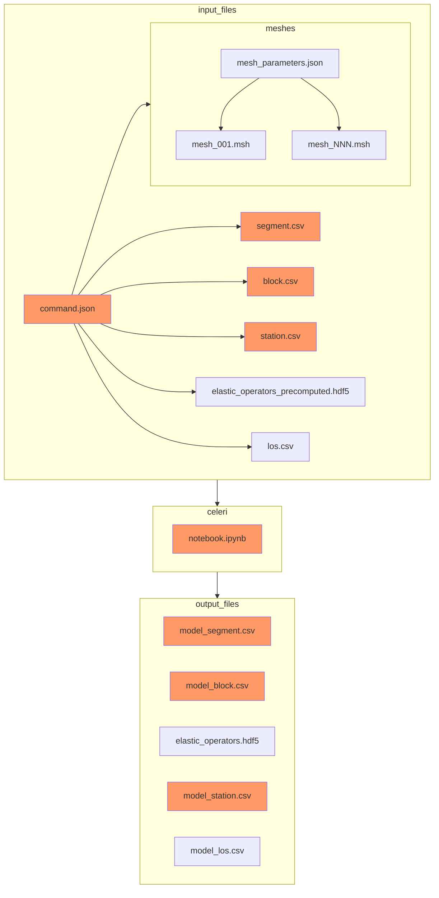

<p align="center">
  
</p>

# Next generation earthquake cycle imaging
`celeri` is a python based library designed to image earthquake cycle and plate tectonic activity including the spatial and time varying fault coupling across geometrically complex fault systems at large scales. 

This is a python reimagining, and extension, of the Matlab-based [blocks](https://github.com/jploveless/Blocks) featuring:
- Smaller memory footprint (via H-matrix compression)
- Faster elastic calculations (via [Ben Thompson's](https://github.com/tbenthompson) [C-based triangular dislocation calculations](https://github.com/tbenthompson/cutde))
- Faster block closure
- Easier IO with standard file types (.csv, .json, .hdf5)


# Getting started

To set up a development conda environment, run the following commands in the `celeri` folder.
```
conda config --prepend channels conda-forge
conda env create
conda activate celeri
pip install --no-use-pep517 -e .
```

Then start your favorite notebook viewer (`jupyter lab` or `vscode`) and open and run `celeri.ipynb`.


### Folder structure and file locations for applications
A large number of input files can be involved in a model run.  We assume that a project is arranged using the following folder structure:
```
project_name
├── README.md
├── notebooks
│   ├── block_model.ipynb
│   ├── visualize_results.ipynb
│   └── resolution_tests.ipynb
├── command
│   ├── command_001.json
│   └── command_NNN.json
├── segment
│   ├── segment_001.csv
│   └── segment_NNN.csv
├── block
│   ├── block_001.csv
│   └── block_NNN.csv
├── station
│   ├── station_001.csv
│   └── station_NNN.csv
├── mesh
│   ├── mesh_params_001.json
│   ├── mesh_params_NNN.json
│   ├── mesh_001.msh
│   └── mesh_NNN.msh
└── output
    ├── 2022-02-20-17-01-39
    │  ├── 2022-02-20-17-01-39.log
    │  ├── elastic_operators.hdf5
    │  ├── model_segment.csv
    │  ├── model_block.csv
    │  └── model_station.csv
    └── NNNN-NN-NN-NN-NN-NN
       ├── NNNN-NN-NN-NN-NN-NN.log
       ├── elastic_operators.hdf5
       ├── model_segment.csv
       ├── model_block.csv
       └── model_station.csv
```

### The flow of files in and out of celeri
The files listed above flow into celeri through `command.json` file. Files with dark orange background shading are required (automatically generated) and those with light blue background shading are optional (not automatically generated)

