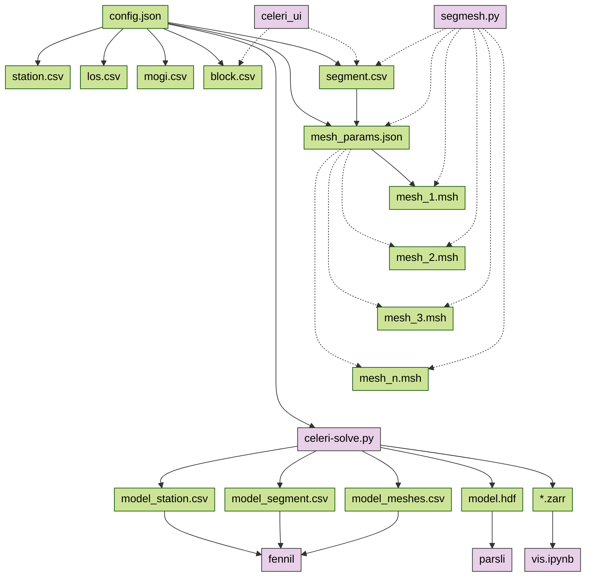

# Quasi-static imaging of earthquake cycle kinematics

[](https://github.com/brendanjmeade/celeri)
[](https://github.com/brendanjmeade/celeri/actions/workflows/test.yml)
[](https://github.com/brendanjmeade/celeri/actions/workflows/release.yaml)
[](https://prefix.dev/channels/conda-forge/packages/celeri)
[](https://pypi.org/project/celeri/)
[](https://pixi.sh)
[](LICENSE)

`celeri` is a Python-based package designed to image earthquake cycle activity, including spatial slip deficit/fault coupling across geometrically complex fault systems at large scales. It features:

- GUI-based model building with [`celeri_ui`](https://brendanjmeade.github.io/celeri_ui/)
- Graphical comparisons of model results with [`result_manager`](https://github.com/brendanjmeade/result_manager)
- 3D visualization of model results with [`parsli`](https://github.com/brendanjmeade/parsli)
- Fast and automated block closure on the sphere
- Large aperture models with locally optimized sphere flattening
- Implicit smoothing and a small memory footprint via distance-weighted eigenmodes
- Slip rate and coupling bounded solves via [sequential quadratic programming](https://agupubs.onlinelibrary.wiley.com/doi/10.1029/2025EA004229)
- Markov chain Monte Carlo (MCMC) uncertainty estimates
- Blazingly fast elastic calculations via [Ben Thompson's](https://github.com/tbenthompson) [cutde](https://github.com/tbenthompson/cutde)
- Easy I/O with standard file types (`.csv`, `.json`, `.hdf5`, `.pkl`)

See the [wiki](https://github.com/brendanjmeade/celeri/wiki) for more detailed information.

## Getting started

`celeri` can be run from the command line or from a Jupyter notebook.

A [project folder structure](#folder-structure-and-file-locations-for-applications) containing a `data/` directory, such as the one provided with this repository, is required to use `celeri`.

After [installation](#installation), you can use `celeri-solve` or [other commands](#command-line-workflow) from the command line:

```bash
cd data/config
celeri-solve some_config.json
```

You can also run `celeri` from a Jupyter notebook, such as those provided in the `notebooks/` directory.

To run notebooks from Visual Studio Code:

1. Ensure that `celeri` is [installed](#installation).
2. Start VS Code, and ensure that the Jupyter extension is installed.
3. Open the project folder (e.g. a clone of this repository).
4. Open the notebook you'd like to run.
5. Click on the Python environment selector near the upper right-hand corner of the VS Code window.
6. If using pixi, select the "default" kernel. Otherwise, select the environment in which you installed `celeri`.
7. Run the notebook.

If VS Code does not show an option for the "default" kernel, ensure that your Jupyter extension is up to date. You may need to restart VS Code after running `pixi shell` for the first time.

## Installation

The simplest way to install `celeri` is to use [pixi](https://pixi.sh/).

```bash
# Create a clone of this repository into the celeri/ directory
git clone https://github.com/brendanjmeade/celeri.git
cd celeri
pixi shell  # Installs and activates the pre-configured celeri "default" environment
```

Note that `pixi` is project-centric, so `pixi` commands only apply if you're within the project directory.

Pixi's support for global project installs is currently very preliminary.
In the meantime, running the following command will create shims for all your favorite celeri commands like `celeri-solve` so you can run them from anywhere:

```bash
pixi run pixi-global-install-shim-hack
```

You can remove these shims by adding the `--remove` flag to this command.

For details about how to use `pixi` in other configurations, or how to install `celeri` with other tools such as `conda`, `pip`, or `uv`, see [alternative-installation.md](alternative-installation.md).

## Command line workflow

### `celeri-solve`

- Estimate model parameters.
- A `*_config.json` file is a required argument.
- With the Python environment activated, run:

```bash
celeri-solve <my_config.json>
```

- This will create a folder in the `runs/` directory that contains all output files.  New folders are created automatically for each run and are sequentially numbered.

- All relative paths in `*_config.json` are resolved relative to the directory containing the config file. Absolute paths are used as-is.

### `celeri-forward`

- Predict surface velocities from model parameters constrained by previous `celeri-solve` run.
- `celeri-forward` is batched so that it never creates large matrices.
- With the Python environment activated, run:

```bash
celeri-forward <path to output folder> <station file for forward model predictions>
```

- If you plan to run `celeri-forward`, you may want gridded locations for model evaluation. Use `create-grid-station`:

```bash
create-grid-station <lon_min> <lat_min> <lon_max> <lat_max> --n_points=<number of grid points>
```

- where:
  - `lon_min`: Minimum longitude
  - `lat_min`: Minimum latitude
  - `lon_max`: Maximum longitude
  - `lat_max`: Maximum latitude
  - `--n_points=<number of grid points>`: Optional. The default value is 100.
- This produces a station file (named `<UUID>_station.csv`) that can be passed to `celeri-forward`.

## Folder structure and file locations for applications

A large number of input files can be involved in a model run.  We assume that a project is arranged using the following folder structure:

```text
project_name/
├── README.md
├── notebooks/
│   ├── block_model.ipynb
│   ├── visualize_results.ipynb
│   └── resolution_tests.ipynb
├── data/
|   ├── config/
│   |   └── *config.json
│   ├── segment/
│   │   └── *segment.csv
│   ├── block/
│   │   └── *block.csv
│   ├── station/
│   │   └── *station.csv
│   ├── mesh/
│   |   ├── *mesh.json
│   |   └── *.msh
|   └── operators/
│       └── *.hdf5
└── runs/
    └── 0000000001/
       ├── 0000000001.log
       ├── output.pkl
       ├── elastic_operators.hdf5
       ├── model_segment.csv
       ├── model_block.csv
       └── model_station.csv
```

## The flow of information through celeri



### Contributing to `celeri`

In order to contribute a GitHub pull request, you'll need to:

1. Set up your Python environment for development
2. Set up your local Git clone for contributions

If you've installed using pixi as described [above](#installation), your environment is already development-ready. Otherwise, you'll need to ensure `celeri` has been pip-installed in editable mode as per the [alternative installation instructions](alternative-installation.md#installing-for-development).

To reconfigure your local Git clone for contributions, you'll need to [fork the repository](https://github.com/brendanjmeade/celeri/fork) and reconfigure your remotes:

```bash
# After forking the repository to your GitHub account:
git remote rename origin upstream
git remote add origin https://github.com/YOUR_USERNAME/celeri.git
```

Replace `YOUR_USERNAME` with your GitHub username.

## Maintenance notes

See [maintenance-notes.md](maintenance-notes.md) for current best practices for maintaining this repository, in particular:

- [Cutting a new release](maintenance-notes.md#cutting-a-new-release)
- [Updating dependencies](maintenance-notes.md#updating-existing-dependencies)

## Other earthquake cycle kinematics software

We think celeri is pretty great, but there are other great kinematic modeling tools:

- Jack Loveless' and Brendan Meade's MATLAB-based [Blocks](https://github.com/jploveless/Blocks)
- Rob McCaffrey's Fortran-based [TDEFNODE](https://robmccaffrey.github.io/TDEFNODE/TDEFNODE.html)
- Richard Styron's Julia-based [Oiler](https://github.com/cossatot/Oiler)
