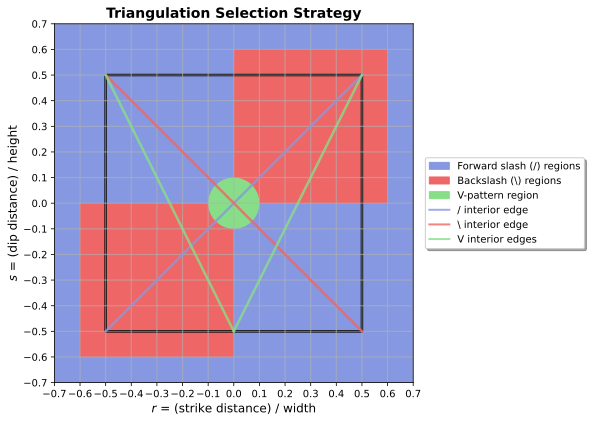

# Auto-Triangulation Methodology

## Motivation

The auto-triangulation algorithm solves a technical challenge in constructing rectangular dislocation elements from triangular dislocation elements (TDEs): avoiding artifacts introduced by the choice of triangulation. Each triangulation introduces computational artifacts due to cancelling singularities that occur along the triangulation edges that lie in the interior of the rectangle.

The primary principle of the algorithm is to ensure **spatial separation** between observation points and these problematic interior edges. Since artifacts only become significant when an observation point is very close to an interior edge, the goal is to choose a triangulation for each observation-point/rectangle pair such that the computation remains stable.

## Triangulation and Interior Edges

The algorithm chooses between three triangulation patterns, each defined by its interior edges:

*   **Forward slash (/)**: A single interior edge runs diagonally from the top-right to the bottom-left corner.
*   **Backslash (\\)**: A single interior edge runs diagonally from the top-left to the bottom-right corner.
*   **V-pattern**: Two interior edges run from the bottom midpoint to the top corners, forming a 'V'.

*Figure 1: Triangulation selection regions and their corresponding interior edges. Blue regions use forward slash (/) triangulation, red regions use backslash (\\) triangulation, and the green central region uses V-pattern triangulation. Thanks to the guaranteed separation between a region and its corresponding internal edge, the same color scheme is used for both the interior edges and the corresponding regions constructed to avoid those edges.*

## Geometric Selection Procedure

The triangulation choice is purely geometric and follows a three-stage process. The logic is based on a normalized coordinate system \((r,s)\) where the rectangle's midpoint is at (0,0) and its edges are at \(r=\pm 0.5\) and \(s=\pm 0.5\).

1.  **Distance to the Plane**
    If the perpendicular distance from the observation point to the rectangle's plane exceeds **10%** of the smaller of the rectangle’s width or height, the **slash (/) triangulation** is always used. In this regime, numerical artifacts from interior edges are negligible.

2.  **Projection into the Rectangle**
    For observation points closer than the 10% threshold, the point is projected onto the rectangle's plane to find its normalized coordinates \((r,s)\).

3.  **Region-Based Triangulation**
    The projected point is then classified using the colored regions shown in *Figure 1*:

    *   **Outermost Band**: If either \(|r|>0.6\) or \(|s|>0.6\), the **slash (/) triangulation** is used as the standard default, since these observation points are already well-separated from the rectangle's interior.

    *   **Central Disk**: Points inside the circle of radius **0.1** (the green disk) receive the **V triangulation**. This is critical for the central region where neither of the simple diagonal triangulations can avoid placing an interior edge near the observation point.

    *   **Intermediate Quadrants**: The remaining area is divided into four quadrants. Points in the top-right and bottom-left quadrants use the **backslash (\\) triangulation**; points in the top-left and bottom-right quadrants use the **slash (/) triangulation**. This ensures that the diagonal interior edge is kept on the opposite side of the observation point.

## Implementation and Performance

The algorithm is implemented in the `_determine_auto_triangulation` function. The logic is fully vectorized for efficiency.

Numerical testing, shows that this selection strategy is robust and close to optimal for a wide range of aspect ratios. It effectively minimizes numerical artifacts from edge singularities and ensures stable, accurate results. The rules handle degenerate (zero width or height) rectangles gracefully by defaulting to the slash triangulation.
